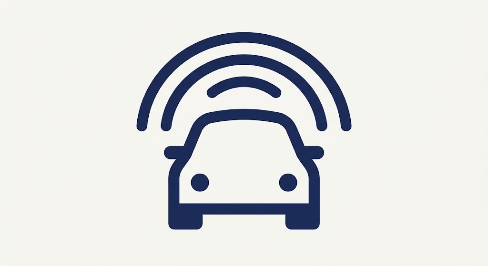

<p align="center">
  
</p>

[](https://pypi.org/project/pyadas/)
[](https://pypi.org/project/pyadas/)
[](https://opensource.org/licenses/MIT)

**pyadas** is a real-time Driver Monitoring System (DMS) tailored for Advanced Driver Assistance Systems (ADAS) applications.

Built purely in Python, the project leverages asynchronous processing (via PySide6), computer vision, and facial geometry (via MediaPipe and OpenCV) to estimate attention, distraction, and fatigue states in real time using conventional hardware (webcams).

> **Important Notice:** This is a software engineering and research prototype. It is **not** a diagnostic medical device and holds **no** certifications to act as a production vehicular safety system.

---

## 📋 Table of Contents
1. [Key Features](#-key-features)
2. [Driver State Estimator](#%EF%B8%8F-driver-state-estimator)
3. [Installation](#-installation)
4. [Usage](#-usage)
5. [Contact](#-contact)

---

## 🚀 Key Features

*   **Dynamic Calibration (Auto-Baseline):** The system relies on no universal hardcoded thresholds. It autonomously calibrates the driver's facial averages within the first few seconds of initialization.
*   **Fatigue Estimation:** Continuous calculation of the Eye Aspect Ratio (EAR).
*   **Temporal Analysis (PERCLOS):** Implementation of the Percentage of Eye Closure metric via a high-performance sliding window for robust drowsiness and potential microsleep detection, bypassing normal blinking false positives.
*   **Yawn Detection:** Mouth Aspect Ratio (MAR) calculation.
*   **Gaze & Pose Estimation:** Approximate calculation of the head's Yaw, Pitch, and Roll angles.
*   **Asynchronous & Responsive UI:** Multi-threaded architecture isolating heavy video acquisition from the graphical user interface built with PySide6.
*   **Telemetry (Black-box logger):** Continuous CSV log recording (EAR, MAR, PERCLOS, FPS, Angles, Driver State) for post-processing and mathematical data cross-referencing.

## ⚙️ Driver State Estimator

The package architecture cross-references geometric and temporal metrics to classify the driver into critical categories:
*   `ALERT`: Normal active visual state.
*   `DISTRACTED`: Prolonged head rotation outside the region of interest.
*   `YAWNING`: Temporal events of severe mouth opening (MAR > threshold).
*   `DROWSY`: Drowsiness indicator triggered when PERCLOS exceeds primary safety levels.
*   `POTENTIAL_MICROSLEEP`: Detection of severe, sustained eye closure over the temporal window.

## 💻 Installation

```console
pip install pyadas
```

## 🛠️ Usage

### Starting the GUI

```python
from pyadas.pyadas_global import pyadasGui

pyadasGui()
```

## ✉️ Contact

Cayo Rawlisom Castoril - [LinkedIn](https://www.linkedin.com/in/cayo-rawlisom-407816247/) | cayorwcs@gmail.com

Project Link: [https://github.com/CayoRw/pyadas](https://github.com/CayoRw/pyadas)