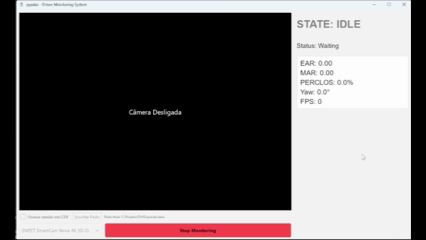

<p align="center">
  
</p>

[](https://pypi.org/project/pyadas/)
[](https://pypi.org/project/pyadas/)
[](https://opensource.org/licenses/MIT)

# pyADAS

### Open-Source Driver Monitoring System for ADAS Applications

**pyADAS** is a real-time Driver Monitoring System (DMS) designed to explore computer vision-based driver state estimation for Advanced Driver Assistance Systems (ADAS).

Built purely in Python, the project leverages a multithreaded real-time processing architecture, a PySide6 graphical interface, and computer vision, and facial geometry (via MediaPipe and OpenCV) to estimate attention, distraction, and fatigue states in real time using conventional hardware (webcams).

> **Important Notice:** This project is a software engineering and research prototype. It is **not** a medical diagnostic device and is not certified or intended to function as a production automotive safety system.

---

<p align="center">
  
</p>

---

## 🚀 Key Features

- **Dynamic Calibration:** Automatic baseline calibration during system initialization.
- **Eye Activity Analysis:** Continuous EAR calculation for eye-closure analysis.
- **PERCLOS:** Sliding-window temporal analysis for drowsiness and potential microsleep detection.
- **Yawning Detection:** MAR-based mouth opening analysis.
- **Head Pose Estimation:** Approximate Yaw, Pitch, and Roll estimation.
- **Driver Distraction Detection:** Identification of prolonged head/gaze deviation from the forward region.
- **Real-Time Processing:** Multithreaded video-processing pipeline with a responsive PySide6 interface.
- **Telemetry:** Continuous CSV black-box logging of perception metrics and driver-state information.

## 🧠 Driver State Estimator

The system combines geometric and temporal measurements to estimate
the driver's current state.

- `ALERT` — Normal visual/attention state.
- `DISTRACTED` — Prolonged deviation from the forward attention region.
- `YAWNING` — Sustained mouth opening detected through MAR analysis.
- `DROWSY` — Drowsiness indicator based on temporal eye-closure analysis.
- `POTENTIAL_MICROSLEEP` — Prolonged eye closure detected through temporal analysis.

## 💻 Installation

```console
pip install pyadas
```

## 🛠️ Usage

### Starting the GUI

```python
from pyadas.pyadas_global import pyadasGui

pyadasGui()
```

## 🧰 Technologies

- Python
- OpenCV
- MediaPipe
- PySide6 / Qt
- NumPy
- Pandas
- Git
- Computer Vision
- GUI Development

## ✉️ Contact

Cayo Rawlisom Castoril - [LinkedIn](https://www.linkedin.com/in/cayo-rawlisom-407816247/) | cayorwcs@gmail.com

Project Link: [https://github.com/CayoRw/pyadas](https://github.com/CayoRw/pyadas)